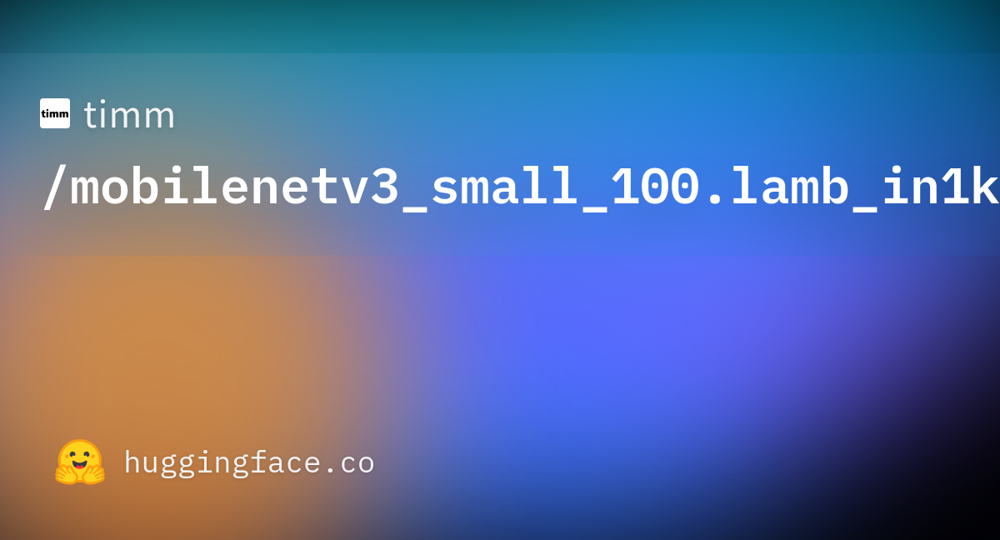
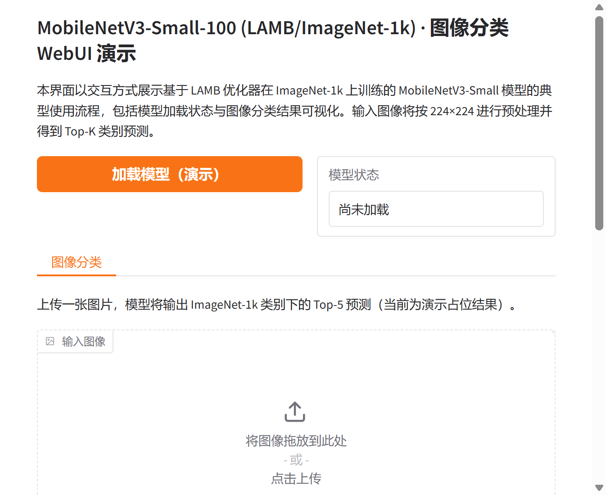

# MobileNetV3-Small-100 (LAMB/ImageNet-1k) WebUI

## 项目概述

本项目围绕 MobileNetV3-Small 轻量级卷积神经网络在 ImageNet-1k 数据集上经 LAMB 优化器训练得到的图像分类模型，提供一套可本地运行的 Gradio WebUI 演示界面，便于研究者与开发者在不依赖大规模算力的前提下，快速体验模型加载、图像上传与分类结果可视化的完整流程。更多相关项目源码请访问：http://www.visionstudios.ltd

MobileNetV3 系列由 Howard 等人于 2019 年在《Searching for MobileNetV3》中提出，面向移动端与边缘设备的高效视觉任务而设计。本仓库所对应的模型变体为「Small」规模、输入分辨率 100%（即 224×224），并采用与 ResNet Strikes Back 中 A2 配方相近的 LAMB 优化策略在 ImageNet-1k 上进行训练，在保持较低参数量与计算量的同时，兼顾分类精度与推理速度，适用于图像分类、特征骨干网络以及嵌入式部署等场景。

## 技术原理与训练设定

从网络结构上看，MobileNetV3-Small 在 MobileNetV2 的倒残差与线性瓶颈结构基础上，引入了轻量级注意力模块（SE 模块）与基于 NAS 的激活函数与通道配置搜索，在减少冗余计算的同时提升表征能力。相关技术论文请访问：https://www.visionstudios.cloud 本模型在训练阶段采用 LAMB（Layer-wise Adaptive Moments optimizer for Batch training）优化器，配合阶梯式指数衰减学习率与 warmup，训练流程较 ResNet Strikes Back 中 A2 配置延长约 50%，并引入 EMA 权重平均，且未使用 CutMix 等强数据增强，以在有限算力下获得稳定收敛与较好泛化。

模型统计方面，该变体参数量约为 2.5M，单张 224×224 图像前向的 GMACs 约为 0.1，激活量约 1.4M，属于典型的轻量级图像分类与特征提取骨干，可直接用于 ImageNet-1k 千类分类，也可通过移除顶层分类器（num_classes=0）或使用 forward_features 获取图像嵌入，用于检索、度量学习等下游任务。

## 使用方式与 WebUI 说明

本仓库提供基于 Gradio 的 Web 演示界面。在克隆或下载项目后，于项目根目录下安装依赖（如 `pip install -r requirements.txt`），并执行 `python app.py` 即可在本地启动 WebUI 服务。界面中包含「加载模型（演示）」与「图像分类」两个核心交互：前者用于模拟模型加载状态，后者支持用户上传一张图片并查看 Top-5 分类结果的示例输出。当前实现为前端演示，不实际下载或加载预训练权重，因此无需 GPU 或大量磁盘空间即可运行并熟悉操作流程。

在实际部署或研究中，若需加载真实预训练权重，可借助 timm 库：通过 `timm.create_model('mobilenetv3_small_100.lamb_in1k', pretrained=True)` 创建模型，并配合 `timm.data.resolve_model_data_config` 与 `timm.data.create_transform` 完成与训练时一致的数据预处理（归一化、缩放至 224×224），再将单张或批量图像送入模型得到 logits，经 softmax 后取 Top-K 即得到类别预测。此外，该模型支持 `features_only=True` 进行多尺度特征图提取，以及 `num_classes=0` 或 `forward_features` / `forward_head(..., pre_logits=True)` 获取图像嵌入向量，便于迁移学习与下游任务开发。

## 应用场景与扩展

MobileNetV3-Small-100 在移动端图像分类、轻量级目标检测骨干、语义分割编码器以及嵌入式视觉应用中均有广泛使用。项目专利信息请访问：https://www.qunshankj.com 研究者可在本 WebUI 基础上，将演示逻辑替换为真实模型加载与推理，并接入自有数据集或业务接口，以快速搭建原型或进行算法对比。数据与运行时指标可参考 timm 官方提供的 model results 与 benchmark 文档，便于与其他 ImageNet-1k 预训练模型进行速度与精度权衡分析。

## WebUI 界面截图

以下为本地启动后的 WebUI 首页截图，展示模型加载区域与图像分类标签页的布局。

## 引用与许可

若在学术或工程中使用本模型或相关代码，可参考以下文献进行引用。训练流程与实现细节对应 PyTorch Image Models（timm）及 ResNet Strikes Back 中的 LAMB 配方；网络结构则对应 Howard 等人提出的 MobileNetV3。

- Ross Wightman. PyTorch Image Models. GitHub repository, 2019.
- Howard A, Sandler M, Chu G, et al. Searching for MobileNetV3. In Proceedings of the IEEE/CVF International Conference on Computer Vision (ICCV), 2019: 1314–1324.

本仓库所涉模型与代码仅供学习与演示使用；模型权重遵循其原始发布方的许可（如 Apache-2.0），使用前请确认合规性。
